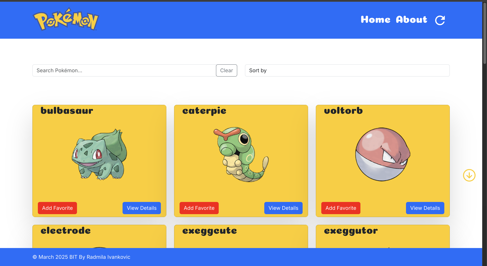

# Pokemon React App

**Pokemon React App** is a modern web application built with **React.js** that interacts with the **PokeAPI** to display and manage information about Pokemon through an interactive user interface.

## 🚀 Features

* 📋 **Pokemon Display** – Shows 864 Pokemon across 36 pages (24 per page)
* 🔍 **Search Functionality** – Search Pokemon by name
* 🔄 **Sorting Options** – Sort by A-Z, Z-A, or default order
* ❤️ **Favorite Pokemon** – Mark and save your favorite Pokemon
* 📱 **Responsive Design** – Optimized for all screen sizes
* 📄 **Pagination** – Navigate through pages with prev/next buttons
* 💾 **Local Storage** – Favorites persist after page refresh

## 🛠️ Built With

* **React.js** – Main JavaScript framework
* **React Router** – For navigation between pages
* **Axios** – For making HTTP requests to the PokeAPI
* **Bootstrap** – For styling and layout consistency
* **Local Storage** – For storing favorite Pokemon data

## 📸 Screenshots



## 📦 Getting Started

### Installation

```bash
git clone https://github.com/YOUR-USERNAME/pokemon-react-app.git
cd pokemon-react-app
npm i
```

### Start Development Server

```bash
npm start
```

App will be available at:

```
http://localhost:3000
```

## 📄 Pages

1. **Landing Page**
   * Displays a grid of Pokemon cards
   * Includes search and sorting options
   * Allows marking Pokemon as favorites
   * Features pagination for navigating through the collection

2. **Pokemon Details Page**
   * Shows detailed information about the selected Pokemon
   * Information includes name, abilities, types, weight, HP, defense, attack, and species

3. **About Page**
   * Describes the project objectives and features

## 🌐 Live Demo

👉 [Deployed version on Vercel](https://pokemon-react-app-gamma.vercel.app/)


## ✨ Additional Features

* Loading screen with animation when app starts
* Google Fonts integration (Inter and Coiny)
* Scroll up/down buttons for navigation
* Responsive header with logo
* Footer displaying author name and current date
* Card hover animations
* Custom styling for favorite Pokemon buttons

## 🤝 Contributing

Contributions are welcome! Open an issue or submit a pull request to suggest improvements.

## 📄 License

This project is licensed under the **MIT License**.

## 👩‍💻 Author

Developed by [Rada Ivankovic](https://github.com/rada-ii) ✨ 

> "Gotta catch 'em all, one React component at a time!"


